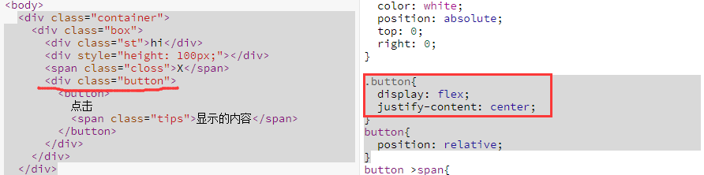

# Position:relative&absolute

## 描述

### relative:

* 相对定位不会脱离文档流，可以有偏移量。
* 可配合z-index使用，数值大的一方显示上层。
* z-index:0;比z-index:-1;大，则"0"在上方。
  
### absolute:

* 脱离原来的位置另起一层。
* absolute是相对于祖先元素中最近一个使用非static的祖先元素定位的(只是相对于relative定位的理解是错误的！)

## 使用技巧总结

* ```css
  white-space:nowrap;/*文字内容不准换行*/
  ```
* 在元素探查模式下展现一个hover的内容步骤：选择对应元素——style——hov——勾选hover

## 我的易错代码

```css
button >span{
  border: 1px solid red;
  display: none;
  position: absolute;
  white-space: nowrap;
  bottom: calc(100% + 5px);
  left: 50%;
  transform: translateX(-50%);
}
```
其中calc括号里的“+”前后各要打一个空格。



想用flex定位时，要在原父元素外再加一层div标签，避免flex与其他属性发生冲突。
  